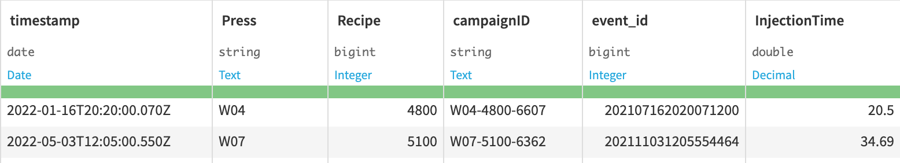
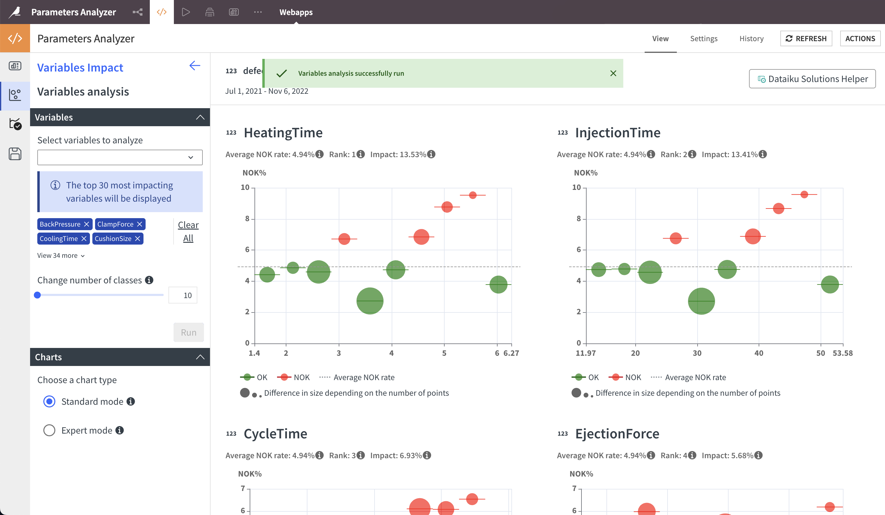
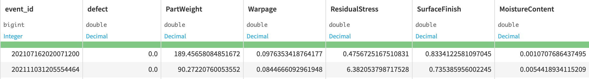

# Data Model

Parameters Analyzer works with two data model options:

- **Unified dataset** containing event IDs, timestamps, parameters and quality classification (e.g., `event,timestamp,quality,parameter` header row)
- **Separated datasets** containing events with at least `event_id` and `timestamp`, plus a target dataset with quality labels. The application matches event IDs and merges all columns.

## Unified Dataset
The solution works with data aggregated to process events, such as product or batch.
Only one dataset is expected, called the product database.

**[Product Database dataset](dataset:product_database)**

This dataset includes aggregated process information with outcome measurements. The schema is flexible but requires:
- A product identifier
- At least one manufacturing process date
- At least one process measure or parameter

General schema:

- `product_identifier` (_string_): Unique product ID
- `identifier_1` ... `identifier_n` (_string_): Various product/process identifiers
- `process_parameter_1` ... `process_parameter_n` (_varies_): Process parameters
- `process_outcome_1` ... `process_outcome_2` (_decimal_, _integer_, _boolean_, etc.): Process outcomes
- `date_1` ... `date_n` (_Date_): Manufacturing process dates

Identifiers pinpoint specific entities (product, process, machine). **Process parameters** are adjustable values affecting product quality. **Process measures** are event-aggregated properties recorded from the product/process. **Dates** are timestamps related to manufacturing.

Example dataset: [agregated_sample_data](dataset:agregated_sample_data)

## Separated Datasets
This solution requires two input datasets:

1. **[Process parameters dataset](dataset:_process_parameters)**: Contains parameter instances on specific events in wide format:

- `event_id` (_string_): Event's unique identifier
- `equipment_id` (_string_): (Optional) Equipment's unique identifier
- `spec_id` (_string_): Parameter set unique identifier
- `process_parameter_1` ... `process_parameter_n` (_float_): Parameters values
- `date` (_date_): Date of parameter instantiation

Note: The schema accepts multiple parameter sets and process parameters.

2. **[Events Information Dataset](dataset:_events_informations)**: Contains event information:

- `event_id` (_string_): Event's unique identifier
- `equipment_id` (_string_): (Optional) Equipment's unique ID
- `start_date` (_date_): (Optional) Start date of the event
- `end_date` (_date_): (Optional) End date of the event
- `outcome` (_string_ / _date_ / _boolean_ / _float_): Process outcome measurement

Note: The schema accepts multiple outcomes.