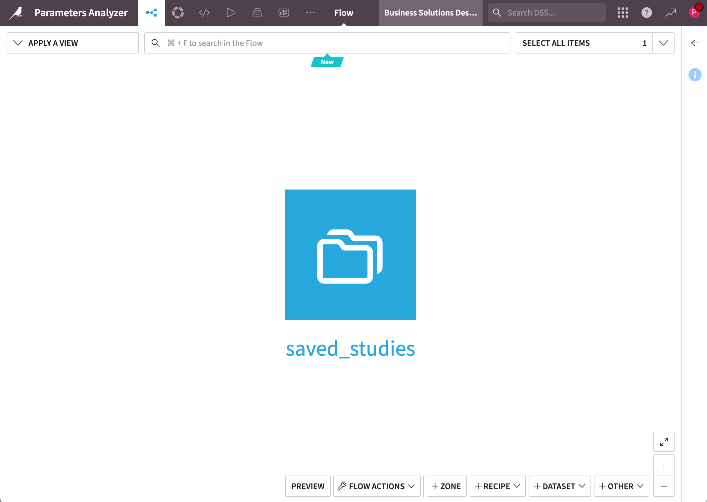
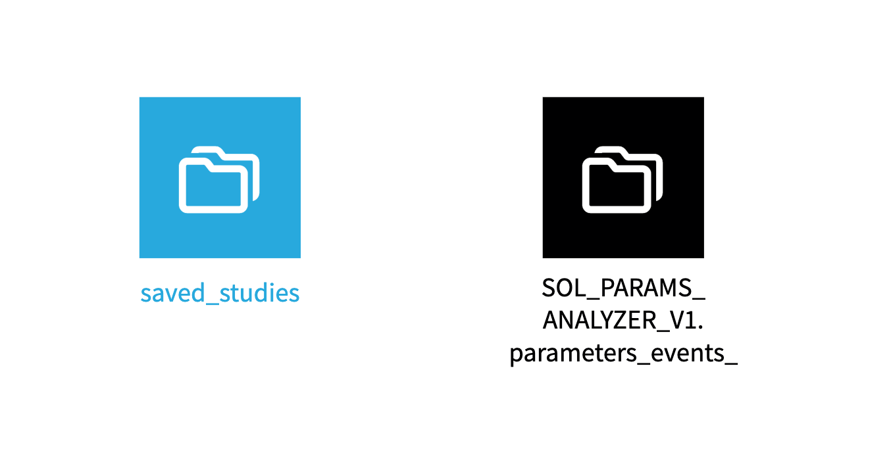
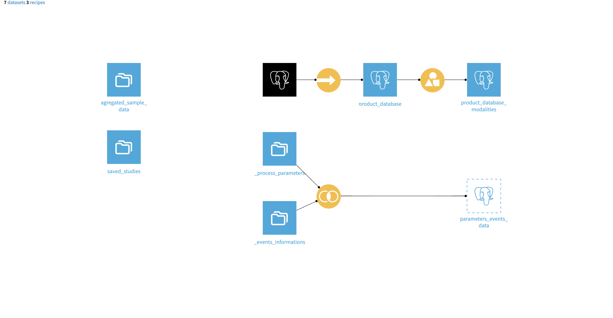

# Parameters Analyzer Flow

The "flow" of Parameters Analyzer contains the dataset and meta storage needed for the application to run.

> **Note**: Running embedded scenarios might affect your flow. If keeping your flow or data unmodified is important, we strongly recommend using a secondary project.

## New Instances
When creating a Parameters Analyzer instance, the initial flow is straightforward: it contains only a "saved studies" dataset to store your conducted studies.

## Adding Data
When you start the application with data, the dataset is added to the flow in one of two ways:

- **Native project datasets** appear as regularly connected datasets
- **Foreign datasets** (from other projects) appear as symbolic links (black icon) to avoid unnecessary duplication. 

> **Note**: Preparing your data in a separate project is strongly recommended to make sure your flows are not altered by the automated scenarios in Parameters Analyzer. 

## Common Flows
A common flow contains the meta storage (studies) and an automatically created flow when used with separate dataset will look something like this:

