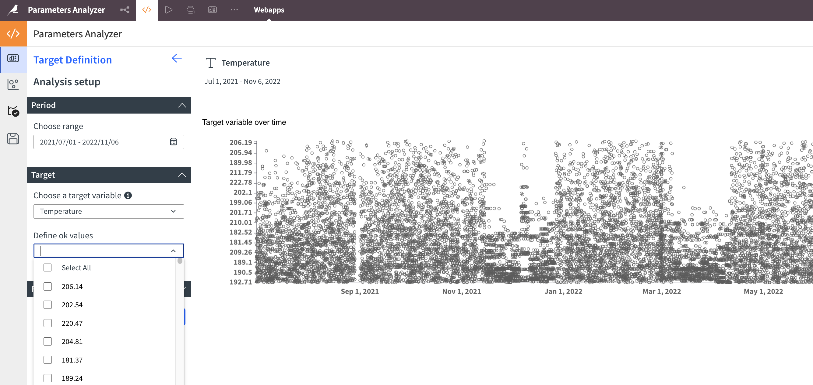
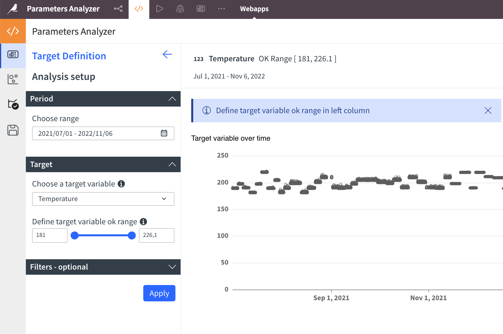
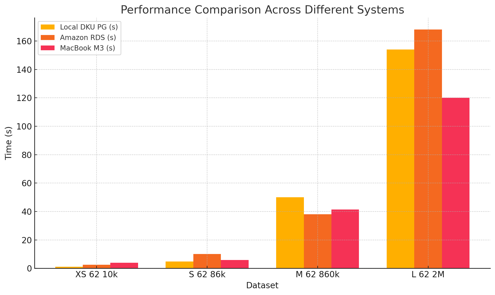
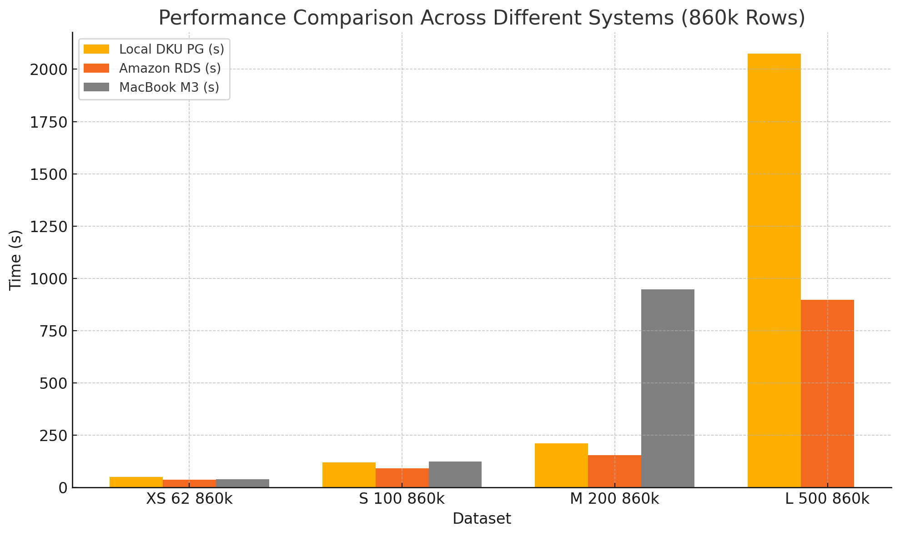

# Performance and Limitations

Parameters Analyzer is designed to operate under specific conditions. Understanding these principles helps you troubleshoot any performance issues.

## Performance Recommendations
Performance depends on three main factors: data preparation, dataset characteristics, and storage/processing choice:

* Follow the [data preparation recommendations](data-prep.md)
* **Downsize your data** where possible for your analysis (smaller is faster)
* **Split datasets** with more than 50 columns (slimmer is faster)
* **Use pushdown mode** for significantly better performance on larger datasets

# Data & Storage Requirements

The application requires at least one date parsed to ISO 8601 format (`yyyy-MM-ddTHH:mm:ss.SSSZ`) [as done in Dataiku](https://doc.dataiku.com/dss/latest/preparation/processors/date-parser.html).

Data types are taken from the dataset schema, not inferred. Ensure:

- Numerical variables are stored as numerical types
- Categorical variables are stored as String

### Incorrect Storage Example

_Numerical variable stored as `String`_: The  icon indicates a categorical variable. The chart isn't ordered properly and shows a modality list instead of a slider.

### Correct Storage Example

_Numerical variable stored correctly_: The  icon indicates a numerical variable with proper display.

# Performance Analysis

We've tested different data sizes and storage types with Parameters Analyzer. As of Release 2.3, the [Processing Mode](processing-mode.md) option (`in-memory` or `pushdown`) affects performance positively (with larger dataset significantly more performant).

These benchmarks provide expectations based on data size and composition. For pushdown mode, performance relates directly to your database configuration.

**Storage and processing environments tested:**

- **Local DKU PG:** AWS [`m5.xlarge`](https://aws.amazon.com/fr/ec2/instance-types/m5/) running PostgreSQL
- **Amazon RDS:** [Amazon RDS](https://aws.amazon.com/fr/rds/) for PostgreSQL
- **MacBook M3:** Apple MacBook Pro with M3 chip

**Dataset naming format:** `<size>_<columns>_<rows>`
- **Size:** XS (Extra Small), S (Small), M (Medium), L (Large)
- **Columns:** Number of columns
- **Rows:** Number of rows

Example: `M_62_860k` has 62 columns and 860,000 rows

## Performance Benchmarks

You can expect analysis of less than a million rows with tens of columns to complete in tens of seconds. Adding columns significantly increases processing time, as dataset size grows by a  `rows * N` per column.

### Datasets with Varied Rows (62 Columns)

| Dataset | Columns | Rows | Local DKU PG (s) | Amazon RDS (s) | MacBook M3 (s) |
|:-------:|:-------:|:----:|:----------------:|:--------------:|:--------------:|
| XS 62 10k | 62 | 10,000 | 1.1 | 2.5 | 3.9 |
| S 62 86k | 62 | 86,000 | 4.8 | 10 | 5.8 |
| M 62 860k | 62 | 860,000 | 50 | 38 | 41.3 |
| L 62 2M | 62 | 2,000,000 | 154 | 168 | 120 |

### Datasets with Varied Columns (860k Rows)

| Dataset | Columns | Rows | Local DKU PG (s) | Amazon RDS (s) | MacBook M3 (s) |
|:-------:|:-------:|:----:|:----------------:|:--------------:|:--------------:|
| XS 62 860k | 62 | 860,000 | 50 | 38 | 39 |
| S 100 860k | 100 | 860,000 | 120 | 91 | 124 |
| M 200 860k | 200 | 860,000 | 210 | 155 | 948 |
| L 500 860k | 500 | 860,000 | 2074 | 897 | N/A |

### Notes:
1. All times in whole seconds
2. "N/A" indicates incomplete processes due to resource constraints
3. Performance varies significantly by dataset size and infrastructure
4. Increasing columns impacts execution time more than increasing rows
5. Numerical data typically scales better than categorical data