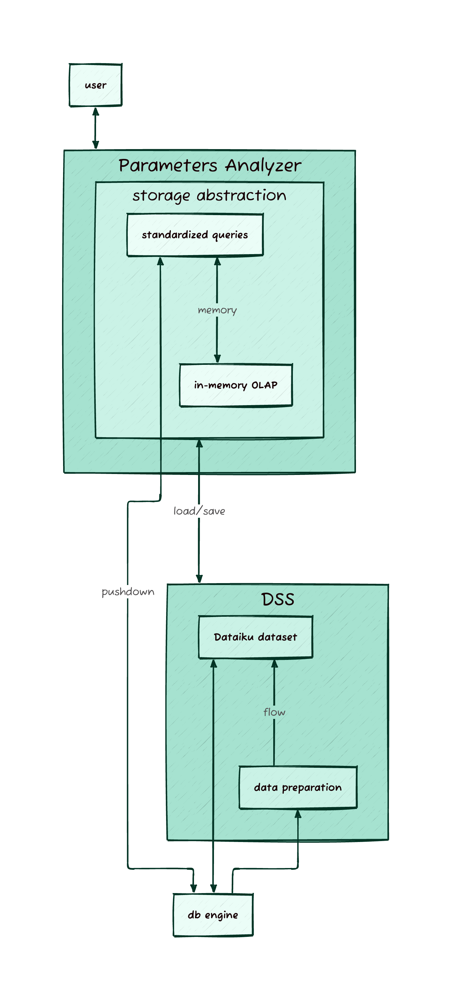

# Processing Mode

[Version 2.3](release-notes.md) of Parameters Analyzer introduced two processing modes: `pushdown` or `memory`. While changing this setting is an admin task (via [global_variables](variables.md)), understanding the difference is important for all users.

## Processing Options

Parameters Analyzer offers two processing approaches to optimize your experience based on data size:

- **Pushdown mode** leverages your underlying database engine for handling large datasets
- **Memory mode** provides a faster experience for smaller datasets by loading everything into application memory

## When to Use Pushdown Mode
- Working with very large datasets (1GB+) or wide datasets (many columns)
- For routine analysis with established parameters

## When to Use Memory Mode
- Working with smaller datasets (<1GB)
- When exploring data and preparing for larger analyses

## Advanced: Deeper Dive
Unlike standard Dataiku flows (pipelines), Parameters Analyzer provides an interactive experience where all data must be available while the application runs.

Parameters Analyzer follows this pattern:

- Data loads from a DSS dataset (external or DSS native storage)
- Data is held in an efficient storage abstraction
- All interactions use standardized SQL queries
- These queries run on either:
  - Your database engine (in `pushdown` mode)
  - An in-memory analytical database (in `memory` mode)

This setup adapts to your needs (either quick response or large dataset capability) while providing an interactive experience.    

### Schematic overview

<!---
d2 code
title: Parameters Analyzer schema {
  near: top-center
  shape: text
  style: {
    font-size: 24
  }
}

direction: up
    
Parameters Analyzer <-> user

Parameters Analyzer: {
storage abstraction: {
    in-memory OLAP <-> standardized queries: memory
}
}

db engine <-> Parameters Analyzer.storage abstraction.standardized queries: pushdown

DSS: {
data preparation -> Dataiku dataset: flow
}

DSS <-> Parameters Analyzer.storage abstraction: load/save

db engine <-> DSS.Dataiku dataset
db engine -> DSS.data preparation
-->

