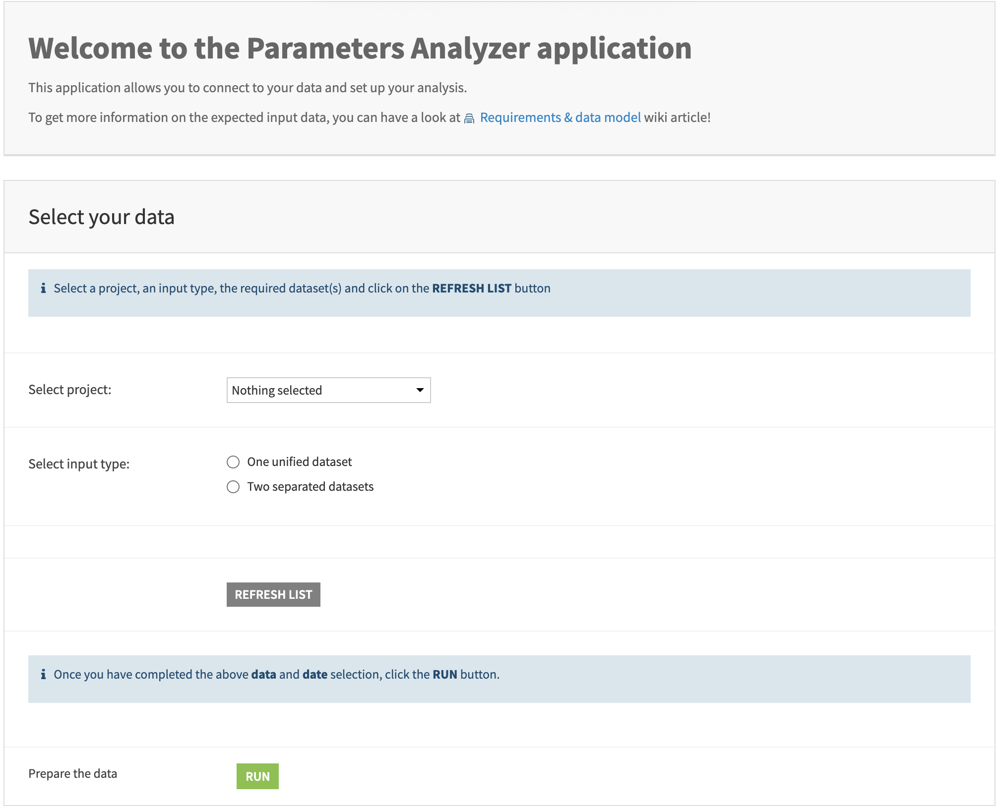
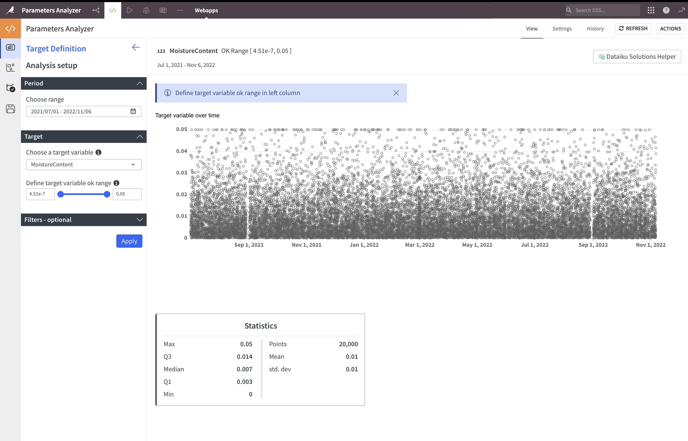
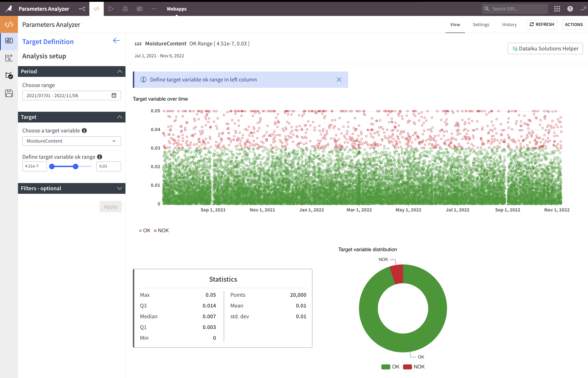
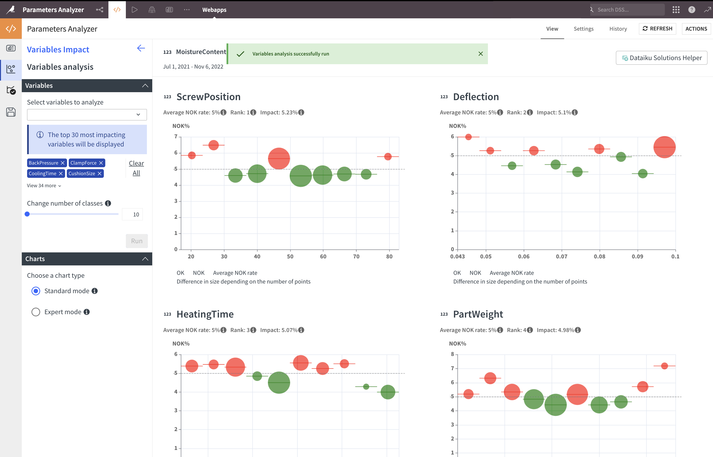
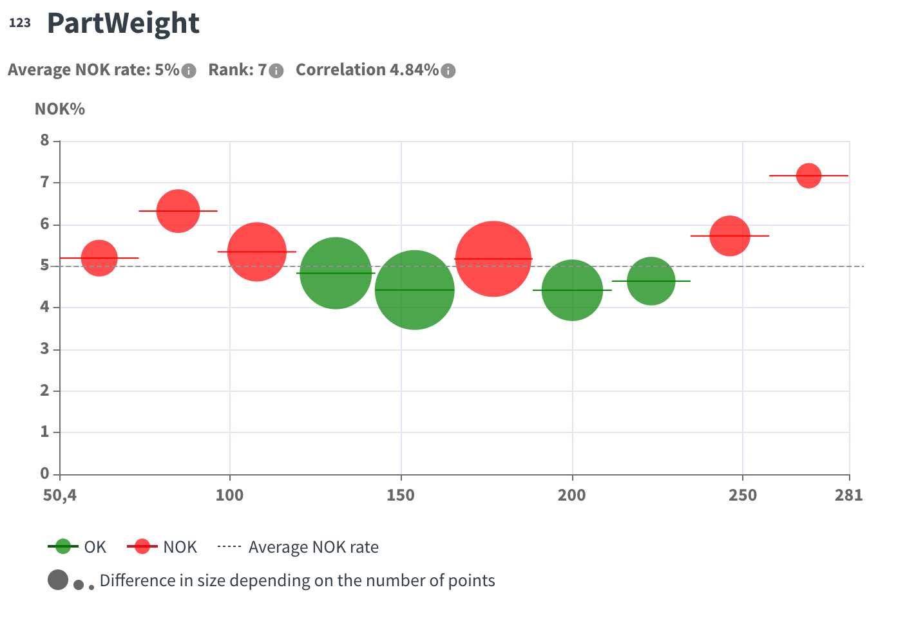
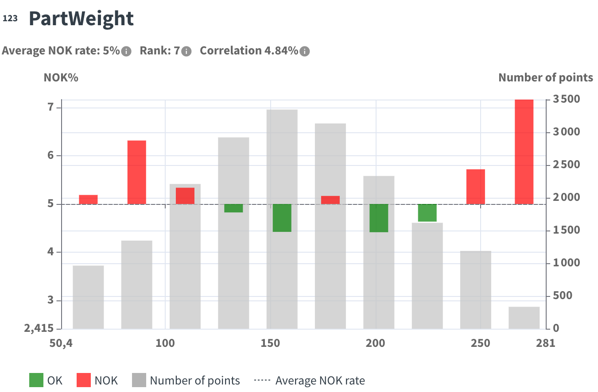
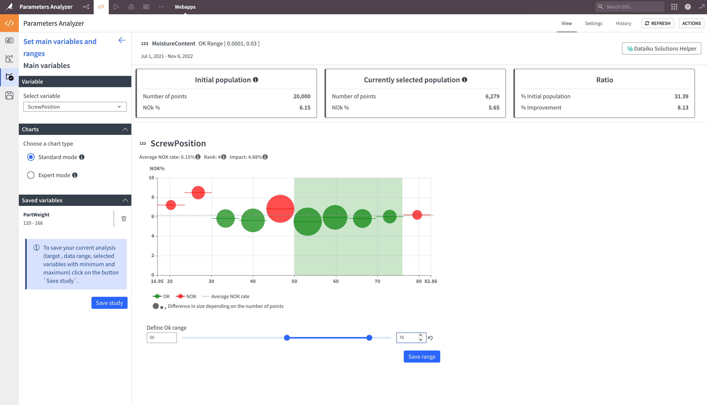
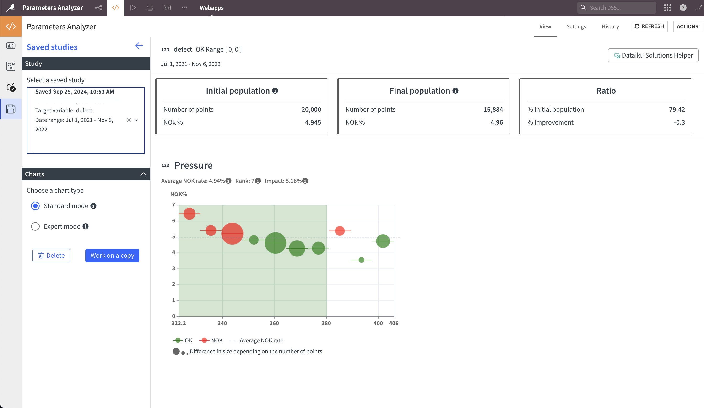

# Walkthrough

## 1. Install Application
Parameters Analyzer installs as a [Dataiku Application](https://doc.dataiku.com/dss/latest/applications/index.html). Once installed, find it on your application homepage.

## 2. Create New Instance
Click **CREATE APP INSTANCE** to create a new instance of the parent project. Create multiple instances to analyze different datasets.

## 3. Application Start Screen
Navigate to your instance to find the start screen, where you'll connect Parameters Analyzer to your data.

### 3.1 Project Selection
Select your [data preparation](data-prep.md) project from the list.

### 3.2 Input Type Selection
Select your dataset type according to your [data model](data-model.md).

### 3.3 Date Selection
Your dataset(s) must include at least one parsed date. Once you've selected the project and dataset(s), available parsed dates will appear.

### 3.4 Run
Click **RUN** after completing the previous steps.

> If you don't complete these steps, your run will fail.

### 3.5 Open Parameters Analyzer
After a successful run, click **OPEN PARAMETERS ANALYZER**.

Start by [launching a new analysis](#launch-a-new-analysis) or [explore saved studies](#explore-saved-studies-and-work-on-a-copy).

## Launch a New Analysis

### Target Definition
1. Select the date range in the period section (entire range is auto-selected)
2. Select a target variable (the outcome you want to analyze)
3. Click Apply

Next, select the OK range or output quality classification of your target variable. The chart displays the target variable distribution:

Add filters for numerical and categorical variables if needed.

### Variables Selection
In the second tab, select variables to analyze. Type in the field to filter.

Once selected, adjust the number of bins (10-30, each bin appears as a circle on the area chart). Learn more about binning in [methodology](methodology.md).

### Run Analysis
Click run to get results: The most impacting variables on your selected outcome are ranked by correlation factor. Each chart shows:

- Variable name and type in the title
- Average NOK rate (percentage of NOK points calculated on non-empty rows)
- Rank and correlation of the variable

In bubble charts:

- Bubble size shows points in each bubble
- Horizontal line shows the interval
- Dashed line shows average NOK rate
- Green color indicates NOK rate below average

In expert mode, the same information appears as a histogram:

- Gray histogram shows number of points
- Bars start from average NOK rate line
- Upward bars show defect rates above average
- Downward bars show defect rates below average

Comparison of display modes:

> Standard mode chart

 

> Expert mode chart

 

### Define a New Rule
Define a rule by combining parameter intervals. Select a variable, adjust the range or select modalities, and click save range.

At the top, you'll see:

- Initial population (points and NOK rate in the analysis)
- Currently selected population (points and NOK rate in selected ranges)
- Ratio (percentage of initial population and improvement in selected ranges)

Results always show the combination of all selected ranges.

## Explore Saved Studies and Work on a Copy
Go directly to the fourth tab to check existing saved studies.
Select a study to display, then work on a copy to reload the study with its saved analysis parameters.

